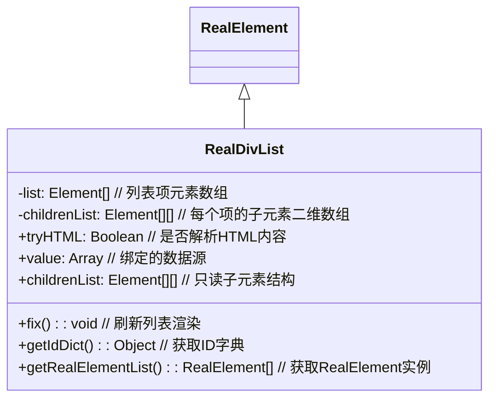
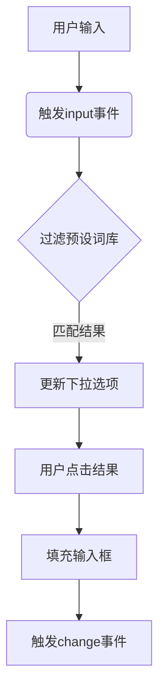

### RealWorld 是什么？
`RealWorld` 是一个**事件循环调度器**，用于管理异步任务队列和执行时序。它的核心功能是创建一个可控的时间驱动循环，按固定时间间隔执行注册的函数队列，同时支持条件触发、Promise 管理等高级异步控制功能。

### 核心特性
1. **时间驱动循环**
   - 通过 `setInterval` 创建循环，默认间隔 10ms
   - 每次循环执行队列中的函数（FIFO 先进先出）

2. **任务队列管理**
   - 使用 `then()` 添加任务到队列
   ```javascript
   world.then(() => console.log("Task 1"))
        .then(() => console.log("Task 2"))
   ```

3. **异步控制**
   - `onceIf(conditionFn)`：条件满足时触发 Promise
   ```javascript
   await RealWorld.onceIf(() => document.readyState === "complete")
   ```

4. **回调转 Promise**
   - `cb2promise()` 将回调式 API 转为 Promise
   ```javascript
   const [error, data] = await RealWorld.cb2promise({
     thisArg: fs, 
     useFn: "readFile"
   }, "file.txt")
   ```

### 使用方法
#### 1. 基础任务调度
```javascript
const world = new RealWorld(30) // 30ms 间隔

world.then(() => {
  console.log("执行任务 A")
  return { data: "A" }
}).then((prevResult) => {
  console.log("收到:", prevResult.data) // "A"
})
```

#### 2. 条件触发
```javascript
const loader = new Image()
loader.src = "image.png"

// 等待图片加载完成
await RealWorld.onceIf(
  () => loader.complete, 
  20 // 检测间隔 20ms
)
```

#### 3. 创建定时任务
```javascript
// 每秒更新计数器
const counter = RealWorld.createInterval(1000, () => {
  console.log(`Tick: ${performance.now()}`)
})
```

#### 4. 生命周期控制
```javascript
// 暂停循环
world.paused = true

// 恢复循环
world.paused = false

// 调整间隔 (会重启循环)
world.setTimeSep(50) 

// 销毁循环 (清除定时器)
world.destroy()
```

### 关键静态属性
| 属性 | 类型 | 说明 |
|------|------|------|
| `onceUserActive` | `Promise` | 用户首次交互时解决的 Promise |
| `onload` | `Promise` | 页面/环境加载完成时解决 |
| `eventLoop` | `RealWorld` | 全局默认事件循环实例 |

### 典型应用场景
1. **游戏主循环**  
   ```javascript
   const gameLoop = new RealWorld(16) // ~60fps
   gameLoop.then(updatePhysics)
          .then(renderScene)
   ```

2. **异步流程控制**
   ```javascript
   await RealWorld.onceIf(() => API.dataLoaded)
   processData()
   ```

3. **UI 更新队列**
   ```javascript
   const uiQueue = new RealWorld()
   button.onclick = () => uiQueue.then(updateUI)
   ```

4. **轮询检测**
   ```javascript
   RealWorld.onceIf(() => {
     return document.querySelector("#result") !== null
   }, 100).then(showNotification)
   ```

> 注意：`RealWorld` 会自动创建全局实例 `RealNode.eventLoop`，可直接使用默认循环：
> ```javascript
> RealNode.eventLoop.then(myTask)
> ```

### RealNode 是什么？
`RealNode` 是实现的核心响应式数据节点类，用于创建和管理具有响应式特性的数据单元。它的主要特点：

1. **响应式数据单元**
   - 封装一个可观察的值（`value`）
   - 自动追踪依赖关系（`relativeRNs`）
   - 值变化时自动通知所有依赖项

2. **核心功能**
   ```javascript
   class RealNode {
     get value()        // 获取当前值
     set value(v)       // 设置值并触发更新
     watch(otherRN)    // 监听其他节点变化
     relate(otherRN)   // 建立单向关联
     notify()          // 主动触发更新通知
   }
   ```

### 核心使用方式

#### 1. 基础用法 - 创建响应式数据节点
```javascript
// 创建初始值为 10 的节点
const numNode = new RealNode({ initValue: 10 });

console.log(numNode.value); // 10

// 修改值（自动触发更新）
numNode.value = 20;
```

#### 2. 创建计算属性
```javascript
const a = new RealNode({ initValue: 5 });
const b = new RealNode({ initValue: 3 });

// 创建动态计算节点（自动更新）
const sum = RealNode.createExpression(
  () => a.value + b.value, // 计算函数
  a, b                     // 依赖节点
);

console.log(sum.value); // 8

// 修改依赖项自动更新
a.value = 10;
console.log(sum.value); // 13
```

#### 3. 节点间依赖关系
```javascript
const source = new RealNode({ initValue: "Hello" });
const target = new RealNode({ initValue: "" });

// 建立单向监听
target.watch(source);

// 当 source 变化时 target 自动更新
source.value = "World";
console.log(target.value); // "World"

// 建立单向关联
const nodeA = new RealNode({ initValue: 1 });
const nodeB = new RealNode({ initValue: 2 });
nodeA.relate(nodeB);

nodeA.value = 5;
console.log(nodeB.value); // 5 (单向同步)
```

#### 4. 自定义行为节点
```javascript
// 自定义 getter/setter
const customNode = new RealNode({
  get() {
    return this.proto.value * 2; // 返回值加倍
  },
  set(v) {
    this.proto.value = Math.max(v, 0); // 确保非负
    return true; // 表示设置成功
  },
  initValue: 5
});

console.log(customNode.value); // 10
customNode.value = -3;
console.log(customNode.value); // 0
```

#### 5. 集合管理 (RealGroup)
```javascript
// 创建响应式对象集合
const userGroup = new RealGroup({
  self: {
    name: "Alice",
    age: 30,
    scores: [85, 90, 78]
  }
});

// 获取嵌套的响应式节点
const ageNode = userGroup.get("age");
ageNode.value = 31; // 自动更新所有依赖

// 批量更新
userGroup.set({ name: "Alice Smith", age: 32 });
```

### 关键优势
1. **自动依赖追踪**  
   节点自动维护依赖关系图，无需手动管理订阅

2. **批量异步更新**  
   通过 `RealWorld` 事件循环批量处理更新，优化性能

3. **深度响应**  
   支持嵌套对象/数组的深度响应式转换

4. **跨环境支持**  
   同时兼容浏览器和 Node.js 环境

5. **内存安全**  
   节点销毁时自动清理依赖关系，防止内存泄漏

### 典型应用场景
1. UI 状态管理（替代部分 Vue/React 状态管理功能）
2. 数据表单绑定
3. 实时计算系统
4. 复杂数据管道
5. 可视化数据流编程


建议结合提供的 `RealElement`、`RealCanvas` 等组件使用，构建完整的响应式应用体系。

`RealGroup` 是响应式编程框架中的核心数据结构，用于管理一组关联的响应式节点(`RealNode`)，提供类似对象的键值对管理能力。以下是详细解析：

### 一、RealGroup 是什么？
1. **核心定位**：
   - 响应式对象容器，管理多个 `RealNode` 的集合
   - 继承自 `RealNode`，具备响应式通知能力
   - 使用 `Proxy` 实现透明数据访问

2. **核心特性**：
   ```javascript
   class RealGroup extends RealNode {
     // 代理对象，提供透明访问
     proxy: Proxy<Object> 
     
     // 监听器映射表
     listenerMap: Map<
       string | symbol | Function, 
       Function[]
     >
   }
   ```

### 二、核心功能解析
1. **数据管理**：
   ```javascript
   // 创建对象容器
   const group = new RealGroup({ self: { name: "Alice", age: 30 } })
   
   // 透明访问属性
   group.proxy.name // "Alice"
   group.proxy.age = 31 // 触发响应
   ```

2. **批量操作**：
   ```javascript
   // 批量更新
   group.set({ 
     name: "Bob", 
     score: 95 
   })
   
   // 条件筛选
   const adults = group.getByFilter(k => group.proxy[k] >= 18)
   // { name: "Bob", age: 31 }
   ```

3. **响应式监听**：
   ```javascript
   // 监听特定属性
   group.addSetterListener("score", (newVal) => {
     console.log(`分数更新: ${newVal}`)
   })
   
   // 监听所有变化
   group.addSetterListener(null, (changedKeys) => {
     console.log("变化的键:", changedKeys) // ['name', 'age']
   })
   ```

### 三、使用场景示例
1. **用户状态管理**：
   ```javascript
   // 创建用户状态组
   const userState = new RealGroup({
     self: {
       isLogin: false,
       token: null,
       profile: { name: "", id: 0 }
     }
   })
   
   // 登录状态监听
   userState.addSetterListener("isLogin", (loggedIn) => {
     loggedIn ? showDashboard() : showLogin()
   })
   
   // 更新状态
   userState.set({
     isLogin: true,
     token: "eyJhbGci...",
     profile: { name: "Alice", id: 123 }
   })
   ```

2. **表单数据绑定**：
   ```javascript
   // 创建表单组
   const formData = new RealGroup({
     self: {
       username: "",
       password: "",
       remember: false
     }
   })
   
   // 绑定输入事件
   document.getElementById("username").addEventListener("input", (e) => {
     formData.proxy.username = e.target.value
   })
   
   // 表单提交
   document.getElementById("submit").addEventListener("click", () => {
     if(formData.proxy.username && formData.proxy.password) {
       login(formData.getByFilter()) // 获取所有数据
     }
   })
   ```

### 四、特殊能力
1. **自动节点转换**：
   ```javascript
   // 启用自动 RealNode 转换
   group.tryRealNodeSetter = true
   
   // 普通值自动转为隐藏节点
   group.proxy.score = 85 // 转为 RealNode
   ```

2. **嵌套数据支持**：
   ```javascript
   // 嵌套对象自动管理
   group.proxy.address = {
     city: "Beijing",
     street: "Main St"
   }
   
   // 监听嵌套属性
   group.addSetterListener("address.city", (city) => {
     console.log(`城市变更: ${city}`)
   })
   ```

### 五、最佳实践建议
1. **性能优化**：
   ```javascript
   // 批量更新减少通知次数
   group.set({ /* 多属性更新 */ })
   
   // 精确监听避免全局触发
   group.addSetterListener("criticalKey", handler)
   ```

2. **错误处理**：
   ```javascript
   try {
     group.set(invalidData)
   } catch (e) {
     console.error("更新失败", e)
     group.react() // 手动触发响应
   }
   ```

> **核心价值**：`RealGroup` 解决了复杂状态管理中的响应式同步问题，通过对象化接口降低使用门槛，配合监听机制实现高效数据流控制。特别适合表单管理、状态容器、配置中心等需要结构化响应的场景。

`RealTarget` 是 `real-node` 框架中用于**绑定 DOM 元素与响应式数据**的核心类，继承自 `RealNode`。它充当 DOM 元素和响应式系统之间的桥梁，实现数据变化时自动更新 DOM。

### 核心功能
1. **单向绑定**：将 DOM 元素的属性（如 `innerHTML/textContent/value`）与响应式数据绑定
2. **自动更新**：当数据变化时自动更新 DOM
3. **转换控制**：提供 `transform` 方法处理数据格式
4. **CSS 管理**：支持动态应用 CSS 规则

### 基本用法
```javascript
// 创建绑定到 div 的 textContent
const div = document.createElement('div');
const target = new RealTarget(
  { self: div, key: 'textContent' }, // 绑定元素和属性
  { initValue: '初始文本' }          // 初始值
);

// 更新数据 (自动更新 DOM)
target.value = '新文本';
console.log(div.textContent); // 输出 "新文本"
```

### 构造函数参数
```javascript
new RealTarget(
  { 
    self: Element,    // 要绑定的 DOM 元素
    key: String,      // 元素属性名 (如 'innerHTML', 'value')
    transform: Function // 可选的数据转换函数
  },
  {
    initValue: Any,   // 初始值
    id: String,       // 自定义 ID
    get: Function,    // 自定义 getter
    set: Function,    // 自定义 setter
    react: Function   // 自定义反应函数
  },
  tryRealNode,        // 是否启用深度响应式
  ...relativeRNs      // 关联的响应式节点
)
```

### 关键方法
1. **`fix()`** - 强制刷新 DOM
   ```javascript
   target.value = '新值'; 
   target.fix(); // 立即更新到 DOM
   ```

2. **`applyCSS()`** - 动态应用 CSS
   ```javascript
   target.applyCSS('div > span', {
     '': { color: 'red' },         // 默认样式
     ':hover': { fontWeight: 'bold' } // 悬停样式
   });
   ```

3. **`clone()`** - 克隆实例
   ```javascript
   const clone = target.clone(true); // 保留值克隆
   ```

4. **CSS 类管理**
   ```javascript
   target.addClassName('active');    // 添加类
   target.toggleClassName('hidden'); // 切换类
   target.removeClassName('old');    // 移除类
   ```

### 使用场景示例
**场景 1：实时文本更新**
```javascript
const scoreDisplay = new RealTarget(
  { self: document.getElementById('score'), key: 'textContent' },
  { initValue: 0 }
);

// 分数变化时自动更新显示
score.value = 100; // 页面显示 "100"
```

**场景 2：表单单向绑定**
```javascript
const input = new RealTarget(
  { self: document.querySelector('input'), key: 'value' },
  { initValue: '' }
);

// 获取实时值
input.value = 'Hello';
console.log(input.get()); // 输出 "Hello"
```

**场景 3：自定义数据转换**
```javascript
const dateDisplay = new RealTarget(
  {
    self: document.getElementById('date'),
    key: 'textContent',
    transform: date => new Date(date).toLocaleString() // 转换时间格式
  },
  { initValue: Date.now() }
);
```

### 重要特性
1. **继承关系**：`RealTarget` → `RealNode` → 基础响应式系统
2. **自动检测**：通过 `isElement` 属性区分 DOM/普通对象
3. **响应式链**：通过 `relate()` 关联其他响应式节点
4. **错误边界**：内置错误处理防止整个系统崩溃

> **提示**：实际使用时常配合 `RealElement.createDiv()` 等工厂方法创建预配置元素，简化开发流程。框架内置了针对常见 DOM 元素的扩展类如 `RealCanvas`/`RealSelect` 等，满足更复杂场景需求。

`RealStory` 是一个**异步任务流控制器**，用于管理复杂异步操作的执行顺序和状态流转。它的核心作用是提供一种结构化方式组织异步任务，类似于工作流引擎。

### 核心功能解析：
1. **层级任务管理**
   - 通过 `newPage()` 创建子任务流（嵌套结构）
   - `pages` 数组存储子任务流队列
   - `fnList` 存储当前层级的异步任务队列

2. **任务调度机制**
   ```javascript
   async launch() {
     while (this.pages.length || this.fnList.length) {
       // 1. 执行当前层任务
       while (this.fnList.length) {
         await this.fnList.pop()?.(this.info);
       }
       
       // 2. 执行子任务流
       await this.pages.shift()?.launch?.();
     }
   }
   ```

3. **协同控制**
   - `newPromiseObj()` 创建带解析控制的特殊 Promise
   - `then(fn)` 添加任务到队列（LIFO后进先出）

### 使用示例：
```javascript
// 1. 创建主任务流
const mainStory = RealStory;

// 2. 添加异步任务
mainStory.then(async (ctx) => {
  console.log("阶段1开始");
  await fetchData();
  ctx.data = processedData; // 传递上下文
});

// 3. 创建子任务流
const subFlow = mainStory.newPage();
subFlow.then(() => handleSubTask());

// 4. 添加可控Promise
const { promise, resolve } = mainStory.newPromiseObj();
mainStory.then(() => {
  setTimeout(() => resolve("完成"), 1000);
  return promise;
});

// 5. 启动任务流
mainStory.launch();
```

### 关键特性：
| 特性 | 说明 |
|------|------|
| **嵌套流程** | 支持无限层级任务嵌套 (`newPage()`) |
| **上下文传递** | `info` 属性跨任务传递数据 |
| **可控Promise** | `newPromiseObj()` 获取可外部解析的Promise |
| **错误隔离** | 子任务错误不会中断主流程 |
| **自动调度** | 集成到脚本事件循环中自动执行 |

### 典型应用场景：
1. **多步骤表单提交**
   ```javascript
   const formStory = RealStory;
   formStory.then(validateInput)
            .then(uploadFiles)
            .then(submitToServer)
            .then(showResult);
   ```

2. **游戏状态管理**
   ```javascript
   const gameFlow = RealStory;
   gameFlow.newPage(loadAssets)
           .newPage(initLevel)
           .newPage(gameLoop);
   ```

3. **复杂动画序列**
   ```javascript
   animationStory.then(showIntro)
                 .then(animateElement1)
                 .newPage(parallelAnimations)
                 .then(finalTransition);
   ```

> 该设计通过层级化任务管理解决了 "回调地狱" 问题，特别适合需要严格顺序执行且包含异步操作的场景。任务流启动后会自动嵌入到脚本的全局事件循环中执行。

`RealPromise` 是框架中增强版的 Promise 实现，它在原生 Promise 基础上扩展了链式操作追踪和跨平台模块加载能力。核心功能和使用方式如下：

### 核心特性
1. **链式操作追踪**  
   - 自动记录所有 `then/catch/finally` 链式调用的结果
   - 通过 `list` 属性访问历史结果数组
   - 通过 `length` 属性获取链式调用次数

2. **跨平台模块加载**  
   - 提供统一的 `require()` 方法
   - 浏览器环境：动态创建 `<script>` 标签加载
   - Node.js 环境：使用原生 `require`

3. **错误处理增强**  
   - 通过 `tryHandler()` 集中处理链式错误
   - 自动记录所有异步操作的错误信息

### 基础用法
```javascript
// 创建实例
const rp = RealPromise.newOne(fetch('/data.json'))

// 链式调用
rp.then(res => res.json())
  .then(data => processData(data))
  .catch(err => console.error(err))

// 获取历史结果
console.log(rp.list) // 查看所有链式结果
console.log(rp.length) // 链式调用次数
```

### 模块加载示例
```javascript
// 动态加载模块
RealPromise.require('lodash')
  .then(_ => {
    _.shuffle([1,2,3]) // 使用加载的模块
  })

// 浏览器加载远程脚本
RealPromise.require('https://cdn.example.com/library.js')
```

### 高级功能
```javascript
// 批量处理链式结果
rp.tryHandler(
  value => {
    // 处理每个成功结果
    console.log('Success:', value)
  },
  err => {
    // 统一错误处理
    console.error('Chain error:', err)
  }
)

// 特殊文件操作（Node.js环境）
const fileRp = RealPromise
fileRp.require('fs').then(fs => {
  fs.readFileSync('data.txt')
})
```

### 设计特点
1. **状态追踪**  
   ```mermaid
   graph LR
   A[初始化Promise] --> B[then1]
   B --> C[then2]
   C --> D[catch]
   D --> E[finally]
   E --> F[list数组记录所有结果]
   ```

2. **跨平台机制**  
   ```javascript
   require(path) {
     if (node环境) 使用 fs 模块
     else 创建<script>动态加载
   }
   ```

3. **错误回溯**  
   通过 `list` 数组可回溯到具体出错的链路节点

> 提示：在浏览器环境中使用时，需确保加载的脚本支持 CORS；在 Node.js 中与传统 `require` 行为一致。该实现特别适合需要详细追踪复杂异步操作链的场景。

### RealElement 是什么？

**RealElement** 是 `real-node` 框架中的核心 DOM 操作类，它继承自 `RealTarget`（最终继承自 `RealNode`）。这是一个专门用于**管理 DOM 元素**的响应式类，主要功能包括：

1. **DOM 元素封装**：将原生 DOM 元素包装成响应式对象
2. **单向数据绑定**：自动同步 DOM 属性与数据状态
3. **样式管理**：提供便捷的 CSS 类操作方法
4. **元素创建**：内置常见元素的工厂方法
5. **事件集成**：支持键盘导航等高级交互

### 核心功能详解

#### 1. 创建 RealElement 实例
```javascript
// 创建新 div 元素
const myDiv = RealElement.createDiv('elementId', '初始内容');

// 从现有元素创建
const existingElement = new RealElement({
  self: document.getElementById('myElement'),
  key: 'innerHTML' // 绑定的属性名
}, { 
  initValue: '初始值' 
});
```

#### 2. 元素操作方法
```javascript
// 增删改类名
myDiv.addClassName('active highlighted');
myDiv.removeClassName('inactive');
myDiv.toggleClassName('selected');

// 应用 CSS 规则
myDiv.applyCSS('div.container', {
  'background-color': 'var(--halfBlack)',
  'padding': '10px'
});

// 获取/设置值
myDiv.value = '新内容'; // 自动更新 DOM
console.log(myDiv.value); // 获取当前值
```

#### 3. 静态工具方法
```javascript
// 创建常见元素
const textarea = RealElement.createTextarea('输入提示...');
const img = RealElement.createImg(true); // 支持强制刷新

// 添加全局 CSS
RealElement.addCSSRules('.my-class', {
  'font-size': '20vmin',
  'transition': 'all 0.3s'
});

// 事件监听 (选择器级联)
RealElement.addEventListenerBySelectors(
  'button.submit', 
  'click', 
  e => console.log('提交按钮点击', e)
);
```

### 典型使用场景

#### 场景 1：动态内容绑定
```javascript
const content = new RealNode({ initValue: '默认文本' });
const displayDiv = RealElement.createDiv('display-area');

// 单向绑定
content.watch(displayDiv.id);
displayDiv.relate(content.id);

// 更新内容会自动刷新DOM
content.value = '更新后的文本';
```

#### 场景 2：创建交互组件
```javascript
// 创建带样式的按钮
const btn = RealElement.createDiv('submit-btn', '提交');
btn.applyCSS('button', {
  'background': 'linear-gradient(#fff, #000)',
  'cursor': 'pointer'
});

// 添加点击事件
btn.self.addEventListener('click', () => {
  console.log('按钮被点击');
  btn.toggleClassName('active');
});
```

#### 场景 3：键盘导航集成
```javascript
// 启用键盘控制
RealElement.applyKeyboardController(myMenu);

// 在元素上添加控制类
myMenuItem.addClassName('keyboardController');

// 键盘交互会自动触发：
// ↑↓←→ 键导航，Enter 键触发点击
```

### 最佳实践建议

1. **元素创建**：优先使用工厂方法 `createXxx()`
2. **样式管理**：使用 `applyCSS()` 替代直接操作 style
3. **响应式集成**：通过 `watch()/relate()` 连接 RealNode
4. **性能优化**：批量操作使用 `RealDivList/RealDivQueue`
5. **事件监听**：使用选择器级联监听提高性能

> **注意**：在非浏览器环境（如 Node.js）下，DOM 相关功能会自动降级，核心响应式逻辑仍可运行。完整功能需要浏览器支持。

`RealCanvas` 是 `real-node` 框架中专门处理 Canvas 操作的类，它继承自 `RealElement`，提供了强大的画布控制和图像处理能力。以下是详细解析和使用指南：

---

### **核心功能**
1. **图像绘制**
   - 支持单图/多图绘制（自动处理预加载）
   - 透明度控制（`opacity`/`tempOpacity`属性）
   ```javascript
   canvas.value = "image.png"; // 单图绘制
   canvas.value = ["bg.jpg", "overlay.png"]; // 多图叠加
   canvas.tempOpacity = [0.7]; // 设置临时绘图透明度
   ```

2. **动态动画**
   - 序列帧动画支持（自动补间、循环控制）
   ```javascript
   canvas.animate({
     prefix: "frame_", 
     suffix: ".png",
     startN: 1, 
     length: 24,  // 总帧数
     midLength: 3, // 文件名补零位数 (e.g., 001.png)
     timeSep: 100  // 帧间隔(ms)
   });
   ```

3. **交互擦除**
   - 鼠标悬停区域擦除
   ```javascript
   const cancelErase = canvas.applyMouseClear({
     radiusX: 30, 
     radiusY: 30,  // 擦除半径
     shape: 'circle' // 擦除形状
   });
   // 取消监听: cancelErase();
   ```

4. **高级操作**
   - 画布分区清除 (`clearShape()`)
   - Blob 转换 (`toBlob()`)
   - 自动尺寸适配 (`resizeBySrc()`)

---

### **基础用法**
#### 1. 初始化 Canvas
```javascript
// 创建新 Canvas (宽800px, 高600px)
const canvas = new RealCanvas("myCanvas", 800, 600);

// 绑定现有元素
const existingCanvas = new RealCanvas(document.getElementById("canvas"));
```

#### 2. 绘制图像
```javascript
// 单图绘制
canvas.value = "https://example.com/image.jpg";

// 多图叠加 (自动按序绘制)
canvas.multiDrawSrcArray({
  bgSrc: "background.png", // 背景图
  autoOpacity: true        // 自动递减透明度
}, "layer1.png", "layer2.png");
```

#### 3. 动画控制
```javascript
const { finished } = canvas.animate({
  prefix: "anim/frame_",
  startN: 0,
  length: 60,
  playMode: 1, // 播放模式 (0-顺序,1-叠加,2-三帧循环)
  sizeMode: 'auto' // 自动匹配图像尺寸
});

finished.then(() => {
  console.log("动画结束");
});
```

#### 4. 交互擦除
```javascript
// 启用圆形擦除 (半径30px)
canvas.applyMouseClear({ 
  radius: 30,
  shape: 'circle'
});

// 编程式擦除矩形区域
canvas.clearShape({
  x: 100, y: 100, 
  radiusX: 50, radiusY: 30
}, 'rect');
```

---

### **关键属性/方法**
| 属性/方法 | 说明 |
|-----------|------|
| **`width`/`height`** | 动态调整画布尺寸 |
| **`ctx`** | 获取CanvasRenderingContext2D上下文 |
| **`img`** | 当前绘制的Image对象 |
| **`clear()`** | 清除整个画布 |
| **`preloadSrc()`** | 预加载图像资源 |
| **`toBlob()`** | 导出画布为Blob对象 |

---

### **使用场景**
1. **游戏开发**  
   - 角色动画序列帧控制
   - 动态背景绘制
2. **图像处理工具**  
   - 图层叠加合成
   - 区域擦除/修复
3. **数据可视化**  
   - 动态图表渲染
   - 交互式热力图

> **注意**：在 Node.js 环境下 Canvas 功能不可用，仅限浏览器环境使用。所有图像操作均为异步，建议使用 `await canvas.loaded` 确保资源就绪。

`RealLoader` 是 `real-node` 框架中用于**文件上传/下载管理**的核心类，根据运行环境自动适配浏览器或 Node.js 的文件操作。以下是详细解析和使用方法：

---

### **核心功能**
1. **双模式支持**：
   - **浏览器环境**：创建隐藏的 `<input type="file">`（上传）或 `<a download>`（下载）元素
   - **Node.js 环境**：使用 `fs` 模块进行文件读写
2. **统一 API**：
   - 上传/下载操作统一通过 `.load()` 方法触发
   - 事件回调：`onerror`（错误处理）、`onloadend`（操作完成）

---

### **构造函数参数**
```javascript
new RealLoader(
  isDownload,     // 布尔值：true=下载模式，false=上传模式
  fileName,       // 字符串：下载时的文件名（仅下载模式有效）
  dataGetter,     // 函数：返回要下载的数据（Blob/ArrayBuffer/String）
  {               // 可选配置：
    innerHTML,    // 元素显示的HTML内容
    onerror,      // 错误回调函数 (error) => void
    onloadend     // 完成回调函数 () => void
  }
)
```

---

### **使用示例**
#### 1. 文件下载器（浏览器）
```javascript
// 创建文本下载器
const textDownloader = new RealLoader(
  true,  // 下载模式
  "demo.txt", 
  () => "Hello World!", // 返回要下载的数据
  {
    innerHTML: '<button>下载文本</button>',
    onloadend: () => console.log("下载完成")
  }
);

// 添加到DOM并触发下载
document.body.appendChild(textDownloader.self);
textDownloader.load(); // 点击按钮触发下载
```

#### 2. 文件上传器（浏览器）
```javascript
// 创建文件上传器
const uploader = new RealLoader(
  false, // 上传模式
  null, 
  null,  // 上传不需要数据生成函数
  {
    innerHTML: '<button>选择文件</button>',
    onloadend: () => console.log("上传完成", uploader.files)
  }
);

// 监听上传结果
document.body.appendChild(uploader.self);
```

#### 3. Node.js 文件操作
```javascript
// 在Node中写入文件
const nodeWriter = new RealLoader(
  true, 
  "log.txt",
  () => Buffer.from("Node.js data")
);

nodeWriter.load().then(([error]) => {
  if (!error) console.log("文件写入成功");
});
```

---

### **关键属性和方法**
| 属性/方法 | 说明 |
|-----------|------|
| **`.files`** | 仅上传模式有效，返回 `FileList` 对象 |
| **`.fileName`** | 仅下载模式有效，获取/设置文件名 |
| **`.load()`** | 触发上传/下载操作，返回 `Promise<[error]>` |
| **`.onerror`** | 自定义错误处理逻辑 |
| **`.onloadend`** | 自定义操作完成逻辑 |

---

### **实现原理**
1. **浏览器环境**：
   - **上传**：动态创建 `<input type="file">` 并触发点击事件
   - **下载**：生成 Blob URL 通过 `<a download>` 触发下载
2. **Node.js 环境**：
   - 使用 `fs.writeFile` 写入文件
   - 自动处理文件名冲突（追加序号）

---

### **注意事项**
1. 浏览器中需要**用户交互**（如点击）才能触发文件操作
2. 下载模式需确保 `dataGetter` 返回有效数据
3. 上传模式可通过 `loader.files` 获取用户选择的文件列表

> 通过统一封装不同环境的文件操作，`RealLoader` 大幅简化了前端/Node.js 的文件管理逻辑，特别适合需要跨平台兼容的场景。

### RealSelect 详解

#### 什么是 RealSelect？
`RealSelect` 是 `real-node` 框架中专门处理下拉选择框的响应式组件，它继承自 `RealElement` 类。主要特点：

1. **增强型下拉框**：
   - 封装原生 `<select>` 元素
   - 支持单选/多选模式
   - 响应式数据绑定
   - 自定义选项渲染

2. **核心功能**：
   - 自动同步选项值和显示文本
   - 值变化时触发响应式更新
   - 支持动态选项更新
   - 与框架的响应式系统深度集成

#### 使用方法

##### 1. 基础创建
```javascript
// 创建单选下拉框
const languageSelect = new RealSelect(
  "langSelect",       // 元素ID（或现有select元素）
  false,              // multiple: 是否多选
  {                   // 选项配置 {显示文本: 值}
    "中文": "zh-CN",
    "English": "en-US",
    "日本語": "ja-JP"
  },
  true,               // 启用响应式
  "中文",             // 默认选中项的文本
  "zh-CN",            // 默认选中项的值
  (e) => console.log("选择改变:", e.target.value) // onchange回调
);
```

##### 2. 动态更新选项
```javascript
// 更新选项（保留当前选中值）
languageSelect.optionConfig = {
  "简体中文": "zh-CN",
  "繁體中文": "zh-TW",
  "English": "en-US"
};

// 强制刷新选中状态
languageSelect.value = languageSelect.value;
```

##### 3. 获取/设置值
```javascript
// 获取当前值（单选返回字符串，多选返回数组）
const selectedLang = languageSelect.value;

// 设置选中值
languageSelect.value = "en-US";

// 多选模式示例
const multiSelect = new RealSelect("multi", true, {...});
multiSelect.value = ["opt1", "opt3"]; // 选中多个值
```

##### 4. 响应式绑定
```javascript
// 创建响应式数据节点
const currentLang = new RealNode({ initValue: "zh-CN" });

// 单向绑定
languageSelect.watch(currentLang);  // 下拉框变化时更新节点
currentLang.watch(() => {           // 节点变化时更新下拉框
  languageSelect.value = currentLang.value;
});
```

#### 高级功能

1. **自定义渲染**：
```javascript
// 自定义选项转换逻辑
languageSelect.protoTransform = (value, defaultKey, defaultValue) => {
  return Object.entries(value).map(([text, val]) => 
    `<option data-flag="${val}" ${val === defaultValue ? 'selected' : ''}>
       🌐 ${text}
     </option>`
  ).join('');
};
```

2. **多选模式特殊处理**：
```javascript
// 获取多选结果
const selectedValues = multiSelect.value; // 返回数组 ["val1", "val2"]

// 批量操作选项
multiSelect.protoSet({
  "Option A": "optA",
  "Option B": "optB",
  "Option C": "optC"
});
```

#### 注意事项
1. **元素创建**：
   - 如果传入的 ID 已存在，会复用现有 `<select>` 元素
   - 否则创建新元素（需手动添加到 DOM）

2. **响应式依赖**：
   - 启用 `tryRealNode: true` 才能参与响应式更新
   - 通过 `watch()` 建立与其他节点的依赖关系

3. **样式扩展**：
   - 默认包含基础样式
   - 通过 CSS 类 `.RealSelect` 自定义样式
   ```css
   .RealSelect {
     border: 2px solid #3498db;
     border-radius: 4px;
     padding: 8px;
     background: #f8f9fa;
   }
   ```

> 提示：`RealSelect` 与框架的 `RealNode`、`RealGroup` 深度集成，可构建复杂的响应式表单系统。在用户选择变化时，会自动触发相关节点的更新通知。

### RealComtag 是什么？

`RealComtag` 是 `real-node` 框架中用于创建 **自定义组件标签** 的类，它继承自 `RealElement`。核心功能是通过类名（className）定义可复用的 UI 组件模板，实现类似 Web Components 的自定义标签功能，但无需浏览器原生支持。

### 核心特性
1. **模板化**  
   将 HTML 结构定义为可复用的模板
2. **CSS 注入**  
   自动为组件注入关联样式
3. **响应式支持**  
   可与 `RealNode` 响应式系统集成
4. **生命周期回调**  
   支持组件初始化后的自定义逻辑

---

### 使用方式

#### 步骤 1：定义组件类
```javascript
RealComtag.defineComtagClass('user-card', {
  optionList: ['div', 'img', 'span'], // 组件内部结构
  cssRuleObjObj: {                    // 组件专属样式
    '': { 
      'border': '1px solid #ccc',
      'padding': '10px'
    },
    'img': {
      'width': '50px',
      'border-radius': '50%'
    }
  },
  callback: function() {              // 初始化回调
    this.self.querySelector('img').src = '/default-avatar.jpg'
  }
});
```

#### 步骤 2：创建组件实例
```javascript
// 创建实例（参数会传递给 callback）
const userCard = RealComtag.createByClassName(
  'user-card', 
  'user123' // 自定义参数
);

// 添加到 DOM
document.body.appendChild(userCard.self);
```

#### 步骤 3：动态更新内容
```javascript
// 修改组件内部元素
const img = userCard.self.querySelector('img');
img.src = '/custom-avatar.jpg';

// 通过响应式系统更新
const nameNode = new RealNode({ initValue: '张三' });
nameNode.watch(() => {
  userCard.self.querySelector('span').textContent = nameNode.value;
});
```

---

### 核心 API 说明

1. **`defineComtagClass(className, config)`**  
   定义组件模板：
   - `optionList`: 组件 DOM 结构（标签名数组）
   - `cssRuleObjObj`: 组件 CSS 规则
   - `callback`: 实例化后的回调函数

2. **`createByClassName(className, ...args)`**  
   实例化组件：
   - `args` 参数会传递给 `callback`
   - 返回 `RealComtag` 实例

3. **成员属性**  
   - `self`: 组件根 DOM 元素
   - `proto.childrenList`: 子元素二维数组

---

### 使用场景示例
```javascript
// 1. 定义模态框组件
RealComtag.defineComtagClass('modal', {
  optionList: ['div.modal-header', 'div.modal-body', 'div.modal-footer'],
  cssRuleObjObj: {
    '': { /* 模态框样式 */ },
    '.modal-header': { /* 头部样式 */ }
  },
  callback: function(title) {
    this.self.querySelector('.modal-header').textContent = title;
  }
});

// 2. 创建登录模态框
const loginModal = RealComtag.createByClassName('modal', '用户登录');

// 3. 动态添加内容
const contentDiv = loginModal.proto.childrenList[1][0];
contentDiv.innerHTML = '<input type="text" placeholder="用户名">';
```

> 优势：统一管理 UI 组件，保持样式/行为一致性，支持响应式数据绑定，减少重复 DOM 操作代码。

### `RealSVG` 是什么？
`RealSVG` 是 `real-node` 框架中专门用于创建和操作 **SVG 元素**的类，继承自 `RealComtag`（通用组件类）。它提供了对 SVG 元素的响应式封装，允许开发者通过代码动态生成、管理和控制 SVG 内容。

---

### 核心功能
1. **SVG 元素创建**  
   动态生成任意 SVG 标签（如 `<circle>`、`<path>`、`<image>` 等）。
2. **子元素管理**  
   支持嵌套 SVG 结构，可批量创建子元素。
3. **响应式设计**  
   与 `RealNode` 系统集成，支持数据绑定和状态更新。
4. **链式配置**  
   支持回调函数对生成的 SVG 元素进行自定义设置。

---

### 使用方法

#### 1. 创建 SVG 根元素
```javascript
const svg = new RealSVG('svg', ['circle', 'rect']);
```
- **参数说明**：
  - `'svg'`：根元素标签名（必须为 SVG 合法标签）
  - `['circle', 'rect']`：子元素标签数组（可选）

#### 2. 自定义配置（通过回调）
```javascript
const svg = new RealSVG('svg', ['circle', 'rect'], null, function(children) {
  // children: 生成的子元素数组 [circleElement, rectElement]
  
  // 配置圆形
  children[0].setAttribute('cx', '50');
  children[0].setAttribute('cy', '50');
  children[0].setAttribute('r', '40');
  children[0].setAttribute('fill', 'red');
  
  // 配置矩形
  children[1].setAttribute('x', '100');
  children[1].setAttribute('y', '10');
  children[1].setAttribute('width', '50');
  children[1].setAttribute('height', '50');
});
```

#### 3. 添加到 DOM
```javascript
document.body.appendChild(svg.self); // 将SVG插入页面
```

#### 4. 动态创建 SVG 图像列表
```javascript
// 创建多个 <image> 元素
const images = RealSVG.newImages([
  'path/to/image1.png',
  'path/to/image2.jpg'
]);

// 返回 DocumentFragment 可直接插入DOM
document.querySelector('svg').appendChild(images);
```

---

### 完整示例
```javascript
// 创建带圆形和矩形的SVG
const svg = new RealSVG('svg', ['circle', 'rect'], null, (children) => {
  children[0].setAttribute('cx', '50').setAttribute('cy', '50').setAttribute('r', '40');
  children[1].setAttribute('x', '100').setAttribute('y', '10').setAttribute('width', '80');
});

// 添加CSS类
svg.addClassName('my-svg-style');

// 插入页面
document.body.appendChild(svg.self);
```

---

### 关键 API
| **方法/属性**       | **说明**                          |
|---------------------|----------------------------------|
| `new RealSVG(tag, children, config, callback)` | 创建 SVG 元素                   |
| `newImages(hrefList)` | 批量创建 `<image>` 元素          |
| `self`              | 获取原生 SVG DOM 元素            |
| `addClassName()`    | 添加 CSS 类（支持响应式更新）    |

> SVG 元素操作使用标准 DOM API：  
> `setAttribute()`, `appendChild()`, `classList.add()` 等。

---

### 应用场景
1. 动态数据可视化（图表、流程图）
2. 交互式矢量图形编辑器
3. 响应式图标系统
4. 游戏中的矢量场景渲染

通过 `RealSVG`，开发者可以像操作普通 DOM 一样管理 SVG，同时享受 `real-node` 的响应式特性，显著简化复杂 SVG 应用的开发流程。

### RealDivList 是什么？

`RealDivList` 是 `real-node` 框架中一个核心的 **动态列表组件类**，用于创建和管理基于 `<div>` 元素的响应式列表系统。主要特点：



### 核心功能
1. **数据驱动渲染**：将数组数据自动转换为 `<div>` 列表
2. **内容解析控制**：
   - `tryHTML=true`：将字符串解析为 HTML
   - `tryHTML=false`：作为纯文本处理
3. **结构化访问**：
   - 通过 `childrenList` 获取嵌套的 DOM 结构
   - 通过 `getIdDict()` 生成 ID 映射表
4. **响应式更新**：修改 `value` 属性自动更新列表

### 使用方法

#### 1. 基础创建
```javascript
// 创建文本列表
const textList = new RealDivList(
  'list-container',  // 容器ID
  false,             // 不解析HTML
  ['苹果', '香蕉', '橙子'] // 数据源
);

// 创建HTML列表
const htmlList = new RealDivList(
  'html-list', 
  true, 
  [
    '<span style="color:red">红苹果</span>',
    '<b>加粗香蕉</b>',
    '<i>斜体橙子</i>'
  ]
);

// 添加到DOM
document.body.appendChild(textList.self);
document.body.appendChild(htmlList.self);
```

#### 2. 动态更新
```javascript
// 初始数据
const dynamicList = new RealDivList('dynamic-list', true, [
  { id: 1, name: '第一项' },
  { id: 2, name: '第二项' }
]);

// 更新数据（自动重渲染）
dynamicList.value = [
  ...dynamicList.value,
  { id: 3, name: '新增项' }
];
```

#### 3. 获取子元素结构
```javascript
// 获取所有列表项的子元素
const childrenStructure = dynamicList.childrenList;

/*
输出结构：
[
  [ // 第一项的子元素
    <div>...</div>,
    <span>...</span>
  ],
  [ // 第二项的子元素
    ...
  ]
]
*/
```

#### 4. 高级用法 - 创建预定义样式列表
```javascript
// 定义自定义列表样式类
RealDivList.defineDivListClass('card-list', {
  tryHTML: true,
  cssRuleObjObj: {
    '': {
      'display': 'grid',
      'grid-template-columns': 'repeat(3, 1fr)',
      'gap': '10px'
    },
    '>div': {
      'border': '1px solid #ccc',
      'padding': '15px',
      'border-radius': '8px'
    }
  }
});

// 使用预定义类创建列表
const cardList = RealDivList.createByClassName('card-list');
cardList.value = [
  '<h3>卡片1</h3><p>内容描述</p>',
  '<h3>卡片2</h3><p>内容描述</p>',
  '<h3>卡片3</h3><p>内容描述</p>'
];
document.body.appendChild(cardList.self);
```

### 实际应用场景
1. **动态内容展示**：商品列表、用户目录等
2. **CMS内容管理**：可编辑的内容区块列表
3. **数据可视化**：结合响应式数据绑定
4. **UI组件库**：构建轮播图、选项卡等复合组件
5. **表单生成器**：动态字段列表

> **提示**：结合 `RealNode` 的响应式系统，当绑定的数据源变化时，列表会自动更新，无需手动操作 DOM。这是 `real-node` 框架的核心优势所在。

`RealImgList` 是一个专门用于管理**动态图片列表**的响应式组件，继承自 `RealDivList`。它针对图片展示场景进行了优化，提供便捷的图片列表管理和响应式更新功能。

### 核心功能
1. **自动渲染图片列表**  
   将传入的图片URL数组自动渲染为`<div></div>`结构
2. **响应式更新**  
   当图片列表数据变化时，自动更新DOM
3. **图片克隆支持**  
   提供`cloneImgList()`方法深度克隆当前图片元素
4. **智能对比更新**  
   通过比较图片`src`差异实现最小化DOM操作

---

### 使用方法
#### 1. 基础创建
```javascript
// 创建包含3张图片的列表
const imgList = new RealImgList(
  'gallery-container', // 容器ID (可选)
  [                   // 图片URL数组
    'img1.jpg',
    'img2.jpg',
    'img3.jpg'
  ]
);

// 添加到DOM
document.body.appendChild(imgList.self);
```
渲染结果：
```html
<div id="gallery-container">
  <div></div>
  <div></div>
  <div></div>
</div>
```

#### 2. 动态更新图片
```javascript
// 更新整个图片列表 (触发响应式渲染)
imgList.value = [
  'new1.png', 
  'new2.png'
];

// 单张图片更新 (自动识别变化)
imgList.value[0] = 'updated.jpg';
```

#### 3. 获取/克隆图片元素
```javascript
// 获取当前所有图片元素
const currentImages = imgList.childrenList;

// 深度克隆图片元素 (不影响原列表)
const clonedImages = imgList.cloneImgList();
document.body.append(...clonedImages);
```

#### 4. 配合响应式系统
```javascript
// 创建响应式数据源
const imageSource = new RealNode({
  value: ['dynamic1.jpg', 'dynamic2.jpg']
});

// 绑定数据源到图片列表
const reactiveList = new RealImgList(
  null, 
  imageSource.value // 传入响应式数据
);

// 数据变化自动更新UI
imageSource.value = ['changed.jpg'];
```

---

### 构造函数详解
```javascript
new RealImgList(
  id,          // 容器元素ID (可选)
  srcList,     // 图片URL数组
  tryRealNode, // 是否启用深度响应式 (默认false)
  selfAssign   // 自定义容器元素 (可选)
)
```

---

### 适用场景
1. 图片画廊/轮播图
2. 动态加载的用户相册
3. 电商产品图片展示
4. 需要频繁更新的图片墙
5. 配合Canvas实现的图片编辑器

> 提示：在需要复杂图片操作的场景中，可结合 `RealCanvas` 组件实现更高级的图片处理功能。组件内置响应式系统确保数据-视图自动同步，无需手动操作DOM。

`RealDivQueue` 是一个**可交互的动态队列组件**，继承自 `RealDivList`，专为创建支持拖拽排序的 DIV 元素队列而设计。以下是核心解析和使用指南：

---

### **核心功能**
1. **拖拽排序**  
   - 用户可通过鼠标拖拽调整队列元素顺序（自动处理位置交换逻辑）
   - 内置动画效果（悬停缩放 + 激活态高亮）

2. **队列管理**  
   - 维护内部顺序索引 `queueArray`
   - 支持编程式排序（`applyQueue()` 方法）

3. **响应式集成**  
   - 继承 `RealNode` 响应式系统，数据变更自动更新视图

---

### **使用方式**
#### 1. 基础创建
```javascript
// 创建队列容器
const queue = new RealDivQueue(
  'queueContainer',  // 容器ID (可选)
  [div1, div2, div3], // 初始元素数组
  true,               // 启用RealNode响应式
  customDiv           // 自定义容器元素 (可选)
);

// 添加到DOM
document.body.appendChild(queue.self);
```

#### 2. 交互控制
```javascript
// 编程式重排序 (索引数组)
queue.applyQueue([2, 0, 1]); // 将原第3个元素移到首位

// 获取当前顺序
const currentOrder = queue.queueArray; // 如 [2,0,1]
```

#### 3. 样式定制
通过预定义CSS类控制样式：
```css
.RealDivQueue > div {
  transition: transform 0.2s; /* 平滑动画 */
}
.RealDivQueue > div:hover {
  transform: scale(1.05);     /* 悬停放大 */
}
.RealDivQueue > div:active {
  background-color: #555;     /* 按压高亮 */
}
```

---

### **工作原理**
1. **事件监听**  
   - 全局监听 `mousedown/mouseup` 实现拖拽检测
   - 自动计算元素交换位置

2. **DOM更新**  
   - 交换元素时使用 `insertAdjacentElement()` 高效更新DOM
   - 通过 CSS `transition` 实现动画效果

3. **数据同步**  
   - 内部维护 `queueArray` 跟踪元素顺序
   - 顺序变更触发响应式更新（`react() + notify()`）

---

### **适用场景**
1. 可排序任务列表
2. 用户自定义面板布局
3. 优先级队列可视化
4. 图片/卡片拖拽排序

> **注意**：需确保加载配套CSS规则（代码中已内置基础样式），可通过 `RealElement.addCSSRules()` 扩展自定义样式。交互依赖于浏览器事件，在Node.js环境需模拟DOM实现。

`createRealDivSelect` 是 `real-node` 框架中用于创建**自定义样式下拉选择框**的函数。它通过 DOM 元素模拟传统 `<select>` 的交互，提供更灵活的样式控制和响应式数据绑定。

### 功能特点
1. **视觉定制** - 完全自定义 CSS 样式
2. **响应式数据** - 与 `RealNode` 系统集成
3. **单选/多选** - 支持 `multiple` 模式
4. **事件驱动** - 提供 `onchange` 回调

### 使用方法
```javascript
// 创建选择器
const mySelect = createRealDivSelect(
  { // 选项配置 (文本: 值)
    "苹果": "apple", 
    "香蕉": "banana",
    "橙子": "orange"
  },
  false, // 是否多选 (默认false)
  function(e) { // 选择变更回调
    console.log("当前选中:", this.value); 
  }
);

// 添加到DOM
document.body.appendChild(mySelect.self);

// 获取/设置值
console.log(mySelect.value); // 获取当前值 (数组)
mySelect.value = ["banana"]; // 设置选中项
```

### 参数说明
| 参数 | 类型 | 必填 | 说明 |
|------|------|------|------|
| `optionConfig` | `Object` | ✓ | 选项列表 `{ 显示文本: 值 }` |
| `multiple` | `Boolean` | ✕ | 是否多选模式 (默认false) |
| `onchange` | `Function` | ✕ | 选择变更回调函数 |

### 核心特性
1. **数据绑定** - 自动同步选项值到 `value` 属性
2. **视觉反馈**：
   - 选中的项添加 `.selected` 类
   - 悬停/点击有缩放动画
3. **样式预设**：
   ```css
   /* 默认样式 */
   .realDivSelect {
     background: linear-gradient(135deg,#fff,#000);
   }
   .realDivSelect > div {
     background-color: #333;
     transform: scale(0.8,1);
   }
   .realDivSelect > div:hover {
     transform: scale(0.9,1);
   }
   .realDivSelect > .selected {
     background-color: #555;
     transform: scale(1);
     font-weight: bolder;
   }
   ```

### 应用场景
1. 需要自定义视觉风格的下拉框
2. 响应式数据驱动的表单
3. 需要特殊交互效果的选择器
4. 替代原生 select 的移动端适配方案

> 提示：在 `real-node` 框架中，所有通过此创建的组件会自动接入全局事件系统和响应式数据流，可与 `RealNode` 其他组件无缝交互。

`createRealDivSearch` 是一个创建**实时搜索组件**的工厂函数，它基于 `RealDivList` 类构建。这个组件包含一个搜索输入框和一个动态匹配结果的下拉选择框，实现类似自动补全的搜索功能。

### 功能特点：
1. **双组件结构**：
   - 顶部：文本输入框（可设置占位符）
   - 底部：动态匹配结果的选择器（基于 `createRealDivSelect`）

2. **实时过滤**：
   - 输入时自动过滤预设词库
   - 不区分大小写的正则匹配

3. **交互逻辑**：
   - 点击搜索结果自动填充到输入框
   - 支持自定义回调函数

### 使用方法：
```javascript
// 创建搜索组件（带占位符）
const search = createRealDivSearch("输入关键词搜索");

// 添加到DOM
document.body.appendChild(search.self);

// 设置搜索词库
search.set(["苹果", "香蕉", "樱桃", "日期", "elderberry"]);

// 获取当前搜索值
console.log(search.get()); // 返回当前输入框内容

// 监听变化事件
search.self.addEventListener('change', e => {
  console.log("选中结果:", search.get());
});
```

### 工作流程：


### 核心实现：
1. **组件结构**：
   ```html
   <div class="realDivSearch">
     <!-- 输入区 -->
     <div>
       <textarea placeholder="..."></textarea>
     </div>
     <!-- 结果区 -->
     <div>
       <div class="realDivSelect">...</div>
     </div>
   </div>
   ```

2. **过滤逻辑**：
   ```javascript
   // 输入时触发过滤
   inputer.addEventListener('input', e => {
     const keyword = e.target.value;
     const regex = new RegExp(keyword, 'i');
     const results = wordList.filter(str => regex.test(str));
     matcher.set(RealNode.arrayToObject(results));
   });
   ```

3. **选择回调**：
   ```javascript
   // 点击搜索结果填充输入框
   resultsContainer.addEventListener('click', e => {
     inputer.value = e.target.dataset.value;
     inputer.dispatchEvent(new Event('change'));
   });
   ```

### 样式特性：
- 结果项悬停放大效果（`transform: scale(0.9,1)`）
- 输入框获得焦点时增强交互
- 响应式布局设计

> 提示：该组件需要配合预设词库使用（通过 `set()` 方法设置）。在用户交互时，它会自动过滤并展示匹配项，优化搜索体验。

`createRealDivSeries` 是定义的一个 **可折叠内容区组件创建函数**，用于生成具有标题栏和可折叠内容区域的 UI 组件。下面详细说明其功能和使用方法：

### 功能特点
1. **折叠/展开功能**：
   - 点击标题栏可切换内容区的显示/隐藏状态
   - 通过添加/移除 `hidden` 类控制折叠状态
2. **响应式标题**：
   - 支持静态字符串、RealNode 响应式节点或函数动态生成标题
3. **内容管理**：
   - 内容区支持字符串文本或 DOM 元素
4. **预置样式**：
   - 标题默认加粗显示（`font-weight: bolder`）
   - 折叠时内容区自动隐藏（`display: none`）

### 使用方法
```javascript
// 1. 创建组件（3种标题定义方式）
const series = createRealDivSeries(标题参数)

// 2. 设置内容项
series.value = [内容1, 内容2, ...]
```

#### 参数说明
| **标题参数类型** | **示例** | **说明** |
|----------------|---------|---------|
| **字符串** | `"我的收藏"` | 静态标题文本 |
| **RealNode** | `myTitleNode` | 响应式标题（值变更自动更新） |
| **函数** | `() => "今日: " + new Date().getDate()` | 动态生成标题 |

#### 内容设置
```javascript
// 设置文本内容
series.value = ["项目1", "项目2", "说明文字..."]

// 设置DOM元素
series.value = [
  document.createElement('img'),
  new RealCanvas(...).self,
  "文字描述"
]
```

### 完整示例
```javascript
// 创建静态标题的折叠面板
const bookSeries = createRealDivSeries("电子书库")

// 添加内容项（混合类型）
bookSeries.value = [
  "JavaScript高级编程",
  new RealCanvas("coverCanvas"),
  document.createElement('hr'),
  "共128本藏书"
]

// 添加到页面
document.body.appendChild(bookSeries.self)

// 动态标题示例
const counterNode = new RealNode({initValue: 0})
const dynamicSeries = createRealDivSeries(
  () => `消息(${counterNode.value})` 
)

// 更新标题（自动刷新）
counterNode.value = 5
```

### 实现原理
组件内部结构：
```html
<!-- DOM结构 -->
<div class="RealDivList realDivSeries">
  <div> <!-- 标题栏 -->
    {{ 传入的标题内容 }}
  </div>
  <div>内容项1</div> <!-- 可折叠部分 -->
  <div>内容项2</div>
</div>
```

**交互逻辑**：
1. 点击标题栏时切换 `hidden` 类
2. CSS 控制折叠状态：
   ```css
   .hidden > div:nth-child(n + 2) {
     display: none; /* 折叠时隐藏内容区 */
   }
   ```

> 提示：该组件已预置响应式支持，当传入 RealNode 作为标题时，标题内容会自动更新，无需手动操作 DOM。